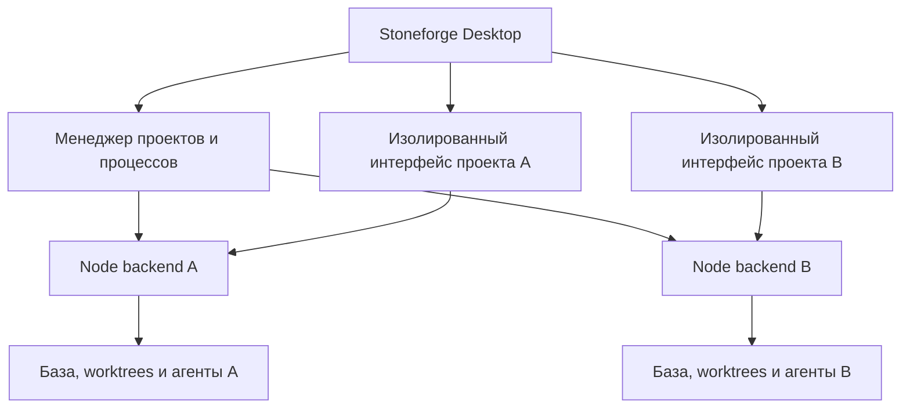

# Stoneforge Desktop: несколько локальных проектов

Статус: в реализации; первый технический preview описан в [desktop-spike.md](desktop-spike.md). Последующие этапы ещё не завершены.
Платформа первой версии: macOS, подтверждено пользователем.
Основание: аудит форка на коммите `bb5f967` и проверка локального запуска.

## Результат для пользователя

Одно приложение Stoneforge с боковой панелью проектов. Пользователь добавляет
каталог, выбирает проект и получает его задачи, директоров, терминалы и настройки.
Приложение само запускает нужный backend и показывает его состояние. Порты не
участвуют в пользовательском сценарии.

Переключение между проектами не прерывает работу агентов. Ошибка или перезапуск
одного backend не переключает другой проект на его данные. Для управления есть
отдельные действия «Остановить проект», «Перезапустить», «Открыть логи».

## Что обнаружено в текущем коде

| Наблюдение | Следствие для проекта |
| --- | --- |
| `packages/smithy/src/server/server.ts` перебирает до 20 портов при `EADDRINUSE` | Адрес проекта меняется в зависимости от порядка запуска. Старая вкладка может продолжить обращаться к уже другому серверу после повторного использования порта. |
| `packages/quarry/src/cli/commands/serve.ts` сохраняет `.dashboard-opened` с PID и временем | Маркер не является реестром экземпляров и не связывает вкладку с проектом. |
| API использует `/api`, WebSocket — `window.location.host` | В адресах запросов нет независимой идентичности проекта или поколения процесса. |
| `/api/health` сообщает состояние сервисов, но не идентификатор проекта и экземпляра | Нельзя надёжно подтвердить, что найден именно нужный backend. |
| `PROJECT_ROOT`, конфигурация, некоторые карты соединений и провайдеры имеют состояние уровня процесса | Размещение нескольких проектов в одном Node-процессе потребует существенного рефакторинга. |
| Общий `UPLOAD_DIR = /tmp/stoneforge-terminal-uploads` | Нужно разделить временные файлы и проверить остальные глобальные пути. |
| React Query создаётся на уровне приложения, настройки хранятся в `localStorage` | Простая замена адреса backend в существующем renderer недостаточна: нужны изоляция состояния и сохранение настроек по проекту. |
| На этом Mac Bun 1.3.11 воспроизводимо ломает `node-pty`; Node 22.23.3 проходит PTY и dashboard-проверки | Desktop должен поставлять проверенный runtime, а не полагаться на системный Node или Bun. |

Это подтверждённые свойства кода и локальной установки. По уточнению пользователя,
исторический сбой возникал при трёх одновременно запущенных инстансах и переключении
между ними в браузере: терялась корректная принадлежность субагентов инстансам.
Версия, точная последовательность действий и логи не сохранились. Неизвестно,
было ли это ошибкой отображения или реального назначения/управления агентами.
Разные порты сами по себе не смешивают HTTP-запросы; считать их установленной
первопричиной нельзя.

Точное воспроизведение старого сбоя не блокирует разработку. На этапе 0 ограничить
его исследование аудитом общих ресурсов и прогоном трёх проектов, затем проверять
явные гарантии изоляции. Если найден воспроизводимый дефект, добавить отдельный
регрессионный тест. Не требовать от пользователя дополнительных исторических деталей.

В репозитории есть `apps/smithy-next` и спецификация Hosts/Runtimes. Это отдельное
направление, интерфейс широко использует mock-data. Desktop v1 основывается на
работающем `apps/smithy-web`; переход на smithy-next, туннели и облачные runtime
не являются зависимостями этой работы.

## Предлагаемая архитектура



**Один проект — один backend-процесс.** Каждый получает явные `cwd`, корень
workspace, путь к базе, каталог временных файлов и окружение. Существующие
singleton-объекты остаются внутри процесса своего проекта.

**Одна оболочка — один менеджер.** На первом этапе менеджер живёт в main-процессе
Electron. Он хранит реестр, управляет запуском/остановкой и проверяет принадлежность
соединений. Второй запуск приложения фокусирует существующее окно.

**Интерфейс проекта — отдельный WebContentsView.** Существующий React-интерфейс
загружается с backend своего проекта. У него отдельная Electron session partition,
собственный React Query, router и терминальные соединения. Переключение проекта
меняет видимую view, а не глобальный адрес API в уже работающем интерфейсе.
Первое открытие создаёт view лениво; переключение не выгружает активный терминал.

Менеджер не открывает SQLite проектов самостоятельно. Все операции над задачами,
агентами и сессиями остаются в соответствующем backend.

### Выбор оболочки

| Вариант | Оценка для этой кодовой базы |
| --- | --- |
| Electron + React + отдельный Node runtime | Рекомендуется: сохраняет TypeScript-стек и текущий UI, поддерживает отдельные WebContentsView и browser sessions. Цена — размер приложения и память нескольких views. |
| Tauri + Node sidecar | Рабочая альтернатива, но добавляет Rust-слой и проверку поведения терминала/Monaco в системном WebView. Нативный Node backend и его зависимости всё равно нужно упаковывать. |
| Только единая веб-страница с локальным менеджером | Возможный промежуточный инструмент диагностики; не даёт желаемого завершённого десктопного сценария. |

Electron выбирается предварительно. Этап 0 должен подтвердить работу упаковки,
PTY, потоковых соединений и расход памяти. Старый BrowserView и HTML `<webview>`
не использовать; основной кандидат — актуальный WebContentsView.

### Runtime и упаковка

Backend запускается отдельным поставляемым Node, а не внутри main-процесса
Electron. Начальная проверенная база — Node 22.23.3; поддерживаемую patch-версию
зафиксировать в manifest сборки после повторной проверки.

`better-sqlite3` собирается под ABI этого Node. `node-pty`, его native addon и
`spawn-helper` проверяются с тем же runtime. Исполняемые/native-файлы размещаются
вне ASAR с правильными разрешениями. Версии UI, backend, runtime и протокола
поставляются согласованным комплектом.

Приложение должно запускаться из Finder без Homebrew, `pnpm`, исходного checkout
или абсолютных путей текущей машины. Codex и Claude Code остаются отдельно
установленными и авторизованными провайдерами; приложение проверяет их наличие,
версии и пути, включая окружение Finder. Общие пользовательские credentials
провайдеров не копируются в проекты и не заменяются пустыми профилями.

## Идентичность, транспорт и блокировки

Реестр хранится в каталоге Application Support приложения. Минимальная запись:

```ts
type ProjectRecord = {
  projectId: string;       // постоянный UUID локальной регистрации
  displayName: string;
  canonicalRoot: string;   // realpath корня workspace
  lastOpenedAt?: string;
};

type RunningInstance = {
  projectId: string;
  instanceId: string;      // новый UUID при каждом запуске backend
  pid: number;
  endpoint: string;        // loopback endpoint, не идентификатор проекта
  protocolVersion: number;
  backendVersion: string;
};
```

1. Канонизировать путь до регистрации. Повторный выбор каталога через symlink
   открывает прежний проект. Разные клоны считаются разными проектами, даже если
   remote URL совпадает. Worktree с общей `.stoneforge` принадлежит тому же
   workspace; отдельно инициализированная workspace — отдельная регистрация.
2. Backend слушает `127.0.0.1` на порту `0`: порт атомарно выбирает ОС. Исправить
   текущий startup-код, чтобы возвращать фактический порт из `server.address()`
   или эквивалента runtime, а не переданное значение `0`.
3. Parent передаёт конфигурацию по управляющему IPC-каналу. Child сообщает
   `ready` только после загрузки базы, регистрации маршрутов и успешного bind.
   Сообщение содержит projectId, instanceId, фактический endpoint и версии.
   Парсинг консольного текста для обнаружения адреса не допускается.
4. Менеджер сверяет identity и версии до открытия view. Проверка повторяется
   после reconnect. Старые соединения не переносятся на новое поколение backend.
5. HTTP, SSE и WebSocket проверяют instance-scoped секрет и ожидаемые IDs.
   Секрет передаётся по IPC, не через URL, аргументы процесса или логи. Для
   существующего UI проверить централизованную инъекцию заголовков на уровне
   Electron session, строго для endpoint соответствующей view; отдельно
   проверить WebSocket upgrade и EventSource. Если это не проходит spike,
   вводится небольшой единый transport adapter — проверка identity не ослабляется.
6. Блокировка на canonical workspace root не позволяет двум новым backend
   одновременно владеть одной `.stoneforge`. Она общая для Desktop и `sf serve`.
   Проверять живой control channel/nonce, а не только PID: PID может использоваться
   повторно. Захват, освобождение и восстановление stale lock должны быть атомарными.
7. Legacy-сервер без этого протокола не присоединяется автоматически. Desktop
   показывает конфликт и способ остановить прежний экземпляр. Сканирование портов
   и совпадение имени проекта не являются доказательством принадлежности процесса.

Секреты экземпляров и browser partitions предотвращают случайное подключение к
чужому backend. Это логическая изоляция приложения, а не файловая песочница для
агентов с полномочиями текущего пользователя macOS.

## Состояние интерфейса и данные

Базы, JSONL, конфигурация, prompts, worktrees и документы остаются в существующих
workspaces. Глобальный реестр содержит только пути, названия и настройки Desktop.
Добавление существующего проекта не выполняет `sf init` и не создаёт новых агентов.

Browser partition изолируется по projectId. При этом `localStorage` всё ещё зависит
от origin, включая порт: одной partition недостаточно для сохранения настроек при
смене endpoint. Нужен явный adapter хранения настроек по projectId в app userData
с browser-реализацией для обычного `sf serve`. Перенести layout, вкладки, черновики,
выбранных агентов и настройки уведомлений; перенос делать по перечню ключей,
не копированием всего browser storage. Чистить общее хранилище при переключении нельзя.

Загрузки и временные файлы разделяются по workspace/instance. Сессии провайдера
сохраняют связь с projectId: resume из проекта A нельзя применить в B. Проверить
глобальное состояние CLI-провайдеров отдельно — процессы Stoneforge не делают
внешний Codex daemon или пользовательский профиль автоматически изолированными.

Принадлежность проверяется по всей цепочке: проект → директор → задача → worker/
субагент → сессия провайдера → событие/результат. Общий менеджер и диагностика
используют projectId вместе с локальными идентификаторами; события процесса также
содержат instanceId. Перед dispatch, resume и применением результата backend
проверяет принадлежность своему workspace. Аудит включает унаследованные cwd/env,
пути обнаружения workspace, MCP/CLI-вызовы агентов, временные файлы и глобальные
реестры провайдеров. Это проверка возможных каналов смешения, не установленный диагноз.

Терминал остаётся живым при переключении. До возможности выгружать views требуется
ограниченный буфер PTY на backend с номером последовательности и явным сообщением
об обрезке истории. Reconnect не должен повторно отправлять пользовательский ввод.

## Жизненный цикл

Состояния менеджера: `stopped → starting → ready → stopping → stopped`; ошибки
старта и падения выводятся отдельно с доступом к логам и ограниченным повтором.

- Открытие проекта запускает backend по требованию. Обнаружение каталога само по
  себе не запускает его агентов. Первый managed-start по умолчанию не возобновляет
  все ранее активные сессии автоматически; пользователь видит доступное восстановление.
- Переключение проекта оставляет его backend и работающих агентов запущенными.
- Закрытие окна macOS оставляет приложение в фоне. Через Dock/меню можно вернуть окно.
- Полный Quit показывает активные задачи и завершает управляемые процессы. Работа
  после полного выхода из приложения через отдельный системный daemon — за пределами v1.
- Остановка проекта прекращает новый dispatch, корректно завершает сессии, экспорт
  и запись состояния, затем закрывает PTY/LSP/provider children, соединения и базу.
  После ограниченного ожидания допускается завершение только принадлежащих ему
  процессов. Ветки, worktrees и незакоммиченный код сохраняются.
- При падении renderer backend продолжает работу. При падении backend UI остаётся
  привязанным к прежнему проекту и показывает ошибку, а не ищет ближайший живой порт.
- При потере parent control channel backend прекращает dispatch и выполняет shutdown.
  Проверить исключение осиротевших PTY и сценарий последующего восстановления.
- Sleep/wake и потеря сети требуют переподключения, а не массового запуска новых
  директоров. Rate limit не должен становиться причиной бесконечного restart loop.

## Первая версия интерфейса

- Список проектов: название, короткий путь, состояние backend, число активных агентов.
- Add Project через выбор каталога, удаление из списка без удаления файлов.
- Постоянно видимый текущий проект и путь; сообщения об ошибках и уведомления
  всегда указывают проект.
- Существующие экраны задач, агентов, терминалов и редактора внутри выбранного проекта.
- Start/Stop/Restart проекта и отдельная панель диагностики.
- Команда `sf open [path]`, открывающая проект в единственном экземпляре Desktop.
  Обычный `sf serve` сохраняется для самостоятельного браузерного использования.

Общий лимит одновременно работающих агентов и лимиты по проектам должны учитываться
до автоматического dispatch: лимиты аккаунтов Codex/Claude общие для нескольких
проектов. В v1 достаточно статического общего предела и разрешений менеджера на
запуск; сложная балансировка и приоритеты проектов откладываются.

## План реализации и условия приёмки

| Этап | Что делаем | Когда этап закончен |
| --- | --- | --- |
| 0. Аудит изоляции и технический прототип | Три проекта с параллельными агентами, переключение вкладок, смена порядка запуска и повторное использование порта; аудит принадлежности субагентов; Electron view + отдельный Node; упаковка PTY/SQLite; HTTP/SSE/WS auth probe | Зафиксированы результаты ограниченного исследования старого сбоя и тестовые сценарии изоляции, независимо от его воспроизведения; оба провайдера отвечают в интерактивном режиме из минимальной `.app`, запущенной Finder; выбраны механизм транспорта и runtime |
| 1. Управляемый backend | Managed entrypoint, `port: 0`, IPC ready/health/stop, IDs, auth, workspace lock, явный shutdown, проектные temp paths | Два backend запускаются независимо; конкурирующий запуск одной workspace отклоняется; чужой instanceId и секрет не принимаются; после остановки не остаются принадлежащие backend процессы |
| 2. Desktop и реестр | `apps/desktop`, single-instance, Add/Open/Remove, project views/partitions, диагностика, запуск по требованию | Два реальных проекта открываются в одном окне; переключение сохраняет работающие терминалы, данные и черновики не переносятся между проектами |
| 3. Сохранение и восстановление | Adapter настроек, PTY replay, восстановление соединений, crash/sleep/wake, лимиты процессов и агентов | Перезапуск с другим портом сохраняет настройки правильного проекта; падение/сбой A не нарушает B; не происходит повторной отправки команд или автоматического дублирования агентов |
| 4. Упаковка и эксплуатация | `.app`, все workspace-зависимости и runtime, обнаружение CLI из Finder, логи и инструкция, `sf open` | Установка в другой каталог работает без исходников, Homebrew Node и абсолютных dev-путей; arm64 проверен на текущем Mac; Intel поддержка заявляется только после собственной сборки и теста |
| 5. Приёмка в повседневной работе | Длительный прогон нескольких проектов, исправление найденных дефектов, проверка отката | Выполнена матрица ниже; ошибки диагностики понятны пользователю; существующие проекты открываются после отката |

Этапы оформлять отдельными небольшими PR. Сначала проверяется риск упаковки и
терминалов; полноценный интерфейс строится после подтверждения этих основ.
Срок оценить после этапа 0 по результатам runtime, auth и packaging-проверок.

Предлагаемые места изменений: `apps/desktop` для оболочки; независимый от Electron
`packages/desktop-manager` для реестра и supervisor; managed startup и shutdown
в `packages/smithy/src/server`; `sf open` и блокировки CLI в `packages/quarry`;
storage/desktop bridge и project-aware диагностика в `apps/smithy-web`.
Протокол выделить в небольшой общий модуль без зависимости от UI.

## Обязательная матрица проверки

1. Три одновременно работающих проекта A, B и C содержат одинаковые локальные
   agent/task IDs и разные данные. Директоры параллельно назначают задачи workers/
   субагентам, пока пользователь переключается между проектами. Назначения,
   provider sessions, события и результаты сохраняют принадлежность проекту;
   это проверяется и в UI, и через API каждого backend. Чтение, изменения,
   PTY-ввод, resize, SSE, LSP и upload попадают только в целевой проект.
2. После остановки A его порт занимает B или посторонний процесс. Старое окно A
   не показывает B и не отправляет ему команды; identity mismatch виден в UI.
3. Параллельный запуск Desktop, повторное открытие через symlink и `sf serve`
   в той же workspace не создают второго владельца базы.
4. Codex и Claude: интерактивный Director, headless Worker, завершение и resume
   в трёх разных проектах; providerSessionId и окружение не пересекаются.
5. Быстрое переключение проектов во время набора текста и выполнения команды:
   ввод не уходит в скрытый терминал; ответ остаётся в исходном проекте.
6. Перезапуск backend, renderer crash, аварийный выход Desktop, sleep/wake,
   большой поток PTY-вывода, отказ провайдера и rate limit.
7. Пять зарегистрированных проектов и несколько реально активных backend;
   измерить память/CPU, рост логов и буферов. Число живых views ограничивается
   только после безопасного восстановления терминала и сохранения черновиков.
8. HTTP/WS без credentials или с credentials другого экземпляра отклоняются;
   IPC не принимает произвольные команды shell, пути или чужую project identity.
9. UI в sandbox с `nodeIntegration: false` и `contextIsolation: true`; preload
   предоставляет только узкие проверяемые операции. Внешние страницы не получают
   доступ к привилегированному bridge, токены не попадают в URL или логи.
10. Реальная `.app` из Finder: запуск при иной PATH, работа SQLite/PTY, пробелы
    и Unicode в путях, перенос приложения, корректное полное завершение.
11. Добавление существующего проекта сохраняет исходные данные. Обновление имеет
    резервную копию перед несовместимой миграцией БД; откат не открывает новую
    несовместимую схему старым backend.

## Границы первой версии

Входят локальные macOS-проекты, оба текущих провайдера, единое окно, управляемые
процессы, сохранение состояния, диагностика и воспроизводимая установка.

Не входят Windows/Linux, удалённые машины, Docker/cloud runtime, единая база всех
проектов, перенос задач между проектами, переписывание UI на smithy-next,
круглосуточная служба после Quit и автоматическое обновление в середине работы.
Подписанный/notarized дистрибутив нужен перед внешним распространением; наличие
Apple credentials уточняется на этапе упаковки. Локальная сборка проверяется раньше.

## Официальные источники для выбранных механизмов

- [Electron WebContentsView](https://www.electronjs.org/docs/latest/api/web-contents-view)
- [Electron session partitions](https://www.electronjs.org/docs/latest/api/session)
- [Electron security recommendations](https://www.electronjs.org/docs/latest/tutorial/security)
- [Tauri external binaries / sidecar](https://v2.tauri.app/develop/sidecar/)

Документ фиксирует архитектурное предложение. Решения, зависящие от поведения
упакованного приложения, окончательно принимаются по результатам этапа 0.
